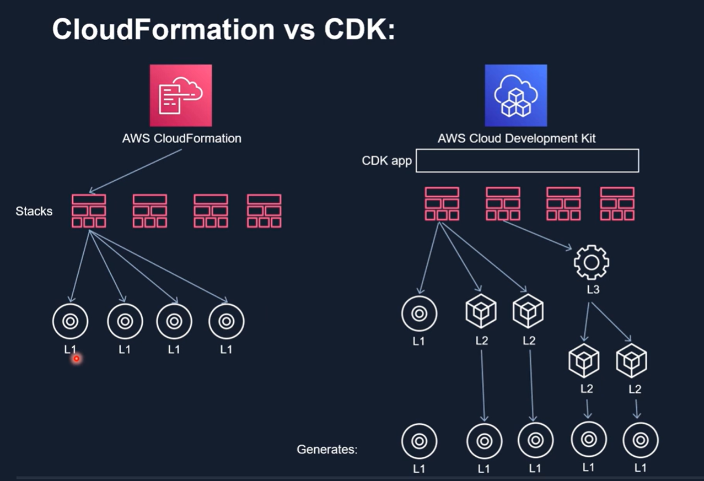

# aws-cdk-course

[Course - aws-typescript-cdk-serverless-react](https://www.udemy.com/course/aws-typescript-cdk-serverless-react/)

## Pre-requirements
- Nodejs - Install Nodejs version 21  by follwoing;
```
sudo apt update &&\
curl -fsSL https://deb.nodesource.com/setup_21.x | sudo -E bash - &&\
sudo apt-get install -y nodejs

# Install npm
sudo apt install npm

# check Nodejs version
node --version
```

- Typescript - Install Typescript
```
sudo npm install -g typescript

# Check typescript version
tsc -v
```

## Create an IAM User
Go to IAM -> Add user -> Enter username -> Next ->  Add permissions -> Check `AdministratorAccess` -> Create

## Install aws-cli
Run the following steps;
```
curl "https://awscli.amazonaws.com/awscli-exe-linux-x86_64.zip" -o "awscliv2.zip"
unzip awscliv2.zip
sudo ./aws/install
```
- Check aws version;
```
aws --version
```

## [Setup aws-cli with the IAM user](https://docs.aws.amazon.com/cli/latest/userguide/cli-authentication-user.html)
- Go to the user created -> Security credentials -> Access Keys -> Create Access key -> Download .csv -> Done.
- Run `aws configure` and enter the `AWS Access Key ID (from .csv file we downloaded)`, `AWS Secret Access Key (from .csv file we downloaded)`, `region name` and `output format (json)`. 

- Now, the aws-cli is configured and we can access the aws services. To verify, run; `aws s3 ls`. If it lists the buckets you created in your account, it is configured successfully. 

This will configured the credentials to use aws-cli but it is not a recommended way as the keys are stored on machine for long-term.
*Todo* - Move the access from long-term to short-term credentials that refresh the credentials automatically. 

## CloudFormation Intro
aws-cdk is created on top of CloudFormation. A *struct* is a group of aws resources. 
- Install aws-cdk (requires npm. Please refer to [Pre-requirements](#pre-requirements) to install it);
```
sudo npm install -g aws-cdk

# To uninstall it
npm uninstall -g aws-cdk
```

Create a cdk project through terminal, run to initialize it;
```
cdk init
```

## Bootstraping the CDK project
*Bootstrapping is the process of preparing an environment for deployment. Bootstrapping is a one-time action that you must perform for every environment that you deploy resources into.*

Bootstraping will create resources needed to deploy AWS CDK apps into this environment.

Bootstrap the project by running the following command from root directory of cdk project;
```
cdk bootstrap
```

## Deploy a basic CDK app
To synthesize;
```
cdk synth
```

To deploy;
```
cdk deploy
```

## CDK Constructs
L1 - CloudFormation resources
L2 - Abstraction over L1 constructs. i.e, aws-s3.Bucket
L3 - Patterns that combine different aws resources together and developer can use it to deploy an entire aws architecture. i.e, *The ecsPatterns.ApplicationLoadBalancedFargateService class is an example of an L3 construct that represents an AWS Fargate service running on an Amazon Elastic Container Service (Amazon ECS) cluster and fronted by an application load balancer.*



## [Cfn Parameters](https://docs.aws.amazon.com/cdk/v2/guide/parameters.html#parameters-about)
CloudFormation Parameters allow definining the variables at deployment time. It is used to make CF templates more widely used accroding to different teams' requirements.

To use the parameter at cdk deployment time;
```
cdk deploy --parameters <parameter_name>=<parameter_value>
cdk deploy --parameters duration=1 # forexample
```

## Destroy a cdk stack
```
cdk destroy <stack_name>
```

## CDK Id's
**Logical Ids** - Used by CDK.
**Physical Ids** - Used by AWS.

It is recommended not to change the logical and physical ids. If we ever want to change the logical id, use 'overrideLogicalId' function.

## CloudFormation Intrinsic Functions
[Intrinsic functions](https://docs.aws.amazon.com/AWSCloudFormation/latest/UserGuide/intrinsic-function-reference.html) are the cloudformation builtin functions to manage the stacks. These are used to assign values to properties which are only available at runtime. For example, we want to use stack id of a stack but it is not avaialable at compile time, so we can use fn.split() or fn.select() functions to parse the stack id of current stack.

## Stack resources cross-references
**[Option1](https://github.com/alexhddev/CDK-course-resources/commit/a3a644661f3019453ef1540ddc45bbc640b7fe31)**: To use the resources of one stack in anohter stack, first we export a resource information using `CnfOutput` with `exportName` fucntions;
```
new CfnOutput(this, 'bucket', {
    value:Bucket.bucketArn,
    exportName: 'bucket-arn'
})
```

Secodly, we import it using `Fn` funcition;
```
const targetBucket = Fn.importValue('bucket-arn')
```

**[Option2](https://github.com/alexhddev/CDK-course-resources/commit/79e2f42436704f5bd9b3cc47deb7adcfbe7c4784)**: to use props and public varoiables that can be accessed throughout the cdk application.

## CDK Aspects
Aspects are a way to apply an operation to all constructs in a given scope. The aspect could modify the constructs, such as by adding tags or enforce rules. Or it could verify something about the state of the constructs, such as making sure that all buckets are encrypted.

For example, if we want to tag a bucket, we can use the `IAspect` from `aws-cdk-lib`.
